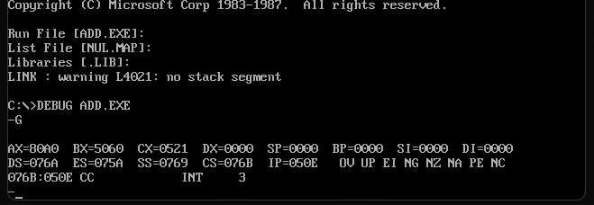
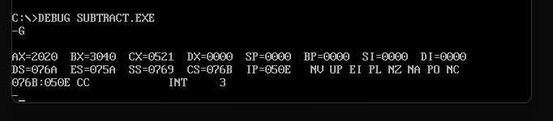
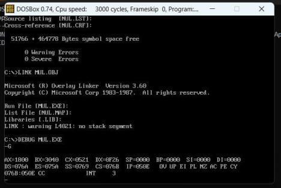
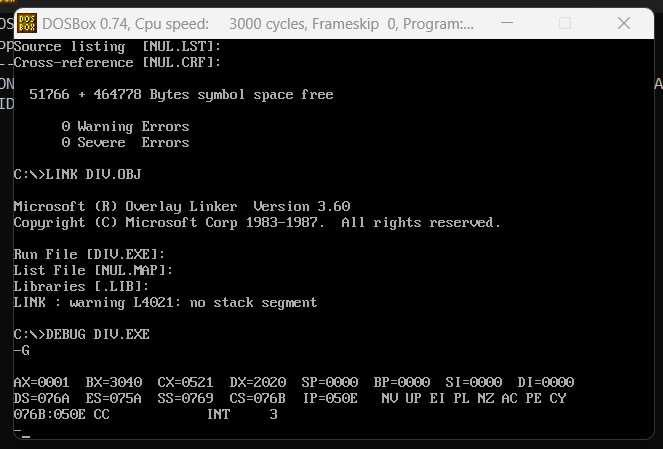

# Microprocessors Lab - Experiment 3

### **Arithmetic Operations on 16-bit Numbers using 8086 Microprocessor**

---

### **Aim**  
To perform addition, subtraction, multiplication, and division of two 16-bit numbers using the 8086 microprocessor and MASM (Microsoft Macro Assembler).

---

### **Requirements**  
- **Microprocessor:** 8086  
- **Software:** MASM (Microsoft Macro Assembler)

---

### **Program Code**

#### **(a) 16-bit Addition**
```assembly
ASSUME CS:CODE, DS:DATA

DATA SEGMENT
    NO1 DW 1234H        ; First 16-bit number
    NO2 DW 5678H        ; Second 16-bit number
DATA ENDS

CODE SEGMENT
START:
    MOV AX, DATA        ; Initialize DS with the address of DATA segment
    MOV DS, AX

    MOV AX, NO1         ; Load first number into AX
    ADD AX, NO2         ; Add second number to AX (result in AX)
    INT 03H
    INT 21H             ; Terminate program
CODE ENDS
END START
```

---

#### **(b) 16-bit Subtraction**
```assembly
ASSUME CS:CODE, DS:DATA

DATA SEGMENT
    NO1 DW 5678H        ; First 16-bit number
    NO2 DW 1234H        ; Second 16-bit number
DATA ENDS

CODE SEGMENT
START:
    MOV AX, DATA        ; Initialize DS with the address of DATA segment
    MOV DS, AX

    MOV AX, NO1         ; Load first number into AX
    SUB AX, NO2         ; Subtract second number from AX (result in AX)
    INT 03H
    INT 21H             ; Terminate program
CODE ENDS
END START
```

---

#### **(c) 16-bit Multiplication**
```assembly
ASSUME CS:CODE, DS:DATA

DATA SEGMENT
    NO1 DW 1234H        ; First 16-bit number
    NO2 DW 0002H        ; Second 16-bit number
DATA ENDS

CODE SEGMENT
START:
    MOV AX, DATA        ; Initialize DS with the address of DATA segment
    MOV DS, AX

    MOV AX, NO1         ; Load first number into AX
    MOV BX, NO2         ; Load second number into BX
    MUL BX              ; Multiply AX by BX (result in DX:AX)
    INT 03H
    INT 21H             ; Terminate program
CODE ENDS
END START
```

---

#### **(d) 16-bit Division**
```assembly
ASSUME CS:CODE, DS:DATA

DATA SEGMENT
    NO1 DW 1234H        ; Dividend (16-bit number)
    NO2 DW 0002H        ; Divisor (16-bit number)
DATA ENDS

CODE SEGMENT
START:
    MOV AX, DATA        ; Initialize DS with the address of DATA segment
    MOV DS, AX

    MOV AX, NO1         ; Load dividend into AX
    MOV BX, NO2         ; Load divisor into BX
    DIV BX              ; Divide AX by BX (quotient in AX, remainder in DX)
    INT 03H
    INT 21H             ; Terminate program
CODE ENDS
END START
```

---

### **Outputs**

#### **(a) 16-bit Addition Result:**  


#### **(b) 16-bit Subtraction Result:**  


#### **(c) 16-bit Multiplication Result:**  


#### **(d) 16-bit Division Result:**  


---

### **Result/Conclusion:**  
We have successfully performed arithmetic operations on two 16-bit numbers and obtained the desired result in the accumulator.

---

**Prepared by:**  
**Name:** Jjateen Gundesha  
**Registration Number:** BT22ECI002  

---
