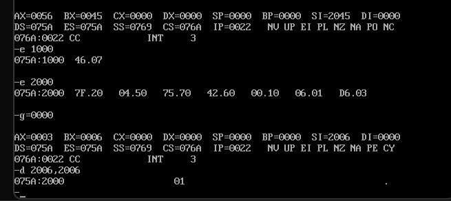
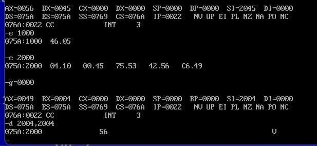

# Microprocessors Lab - Experiment 4

### **Finding the Smallest and Largest Number in a Set of Data Bytes using 8086 Microprocessor**

---

### **Aim**  
To write an Assembly Language Program (ALP) to find the smallest and largest number from a set of entered data bytes using the 8086 microprocessor and MASM.

---

### **Requirements**  
- **Microprocessor:** 8086  
- **Software:** MASM (Microsoft Macro Assembler)

---

### **Program Code**

#### **(a) Finding the Smallest Number:**
```assembly
data segment
    STRING1 DB 08h, 14h, 05h, 0Fh, 09h   ; Data bytes
    res DB ?                             ; Result storage
data ends

code segment
    assume cs:code, ds:data
start:
    MOV AX, data          ; Initialize DS with the address of the data segment
    MOV DS, AX
    MOV CX, 04h           ; Initialize loop counter (number of comparisons)
    
    MOV BL, 79h           ; Initialize BL with a high value (arbitrary)
    LEA SI, STRING1       ; Load address of STRING1 into SI

up:
    MOV AL, [SI]          ; Load the current data byte into AL
    CMP AL, BL            ; Compare AL with BL
    JGE nxt               ; If AL >= BL, skip the update
    MOV BL, AL            ; Update BL with the smallest value

nxt:
    INC SI                ; Move to the next data byte
    DEC CX                ; Decrement loop counter
    JNZ up                ; Repeat until CX is zero

    MOV res, BL           ; Store the smallest value in 'res'
    INT 3                 ; End of program
code ends
end start
```

---

#### **(b) Finding the Largest Number:**
```assembly
data segment
    STRING1 DB 08h, 14h, 05h, 0Fh, 09h   ; Data bytes
    res DB ?                             ; Result storage
data ends

code segment
    assume cs:code, ds:data
start:
    MOV AX, data          ; Initialize DS with the address of the data segment
    MOV DS, AX
    MOV CX, 04h           ; Initialize loop counter (number of comparisons)
    
    MOV BL, 79h           ; Initialize BL with a low value (arbitrary)
    LEA SI, STRING1       ; Load address of STRING1 into SI

up:
    MOV AL, [SI]          ; Load the current data byte into AL
    CMP AL, BL            ; Compare AL with BL
    JLE nxt               ; If AL <= BL, skip the update
    MOV BL, AL            ; Update BL with the largest value

nxt:
    INC SI                ; Move to the next data byte
    DEC CX                ; Decrement loop counter
    JNZ up                ; Repeat until CX is zero

    MOV res, BL           ; Store the largest value in 'res'
    INT 3                 ; End of program
code ends
end start
```

---

### **Outputs**

#### **(a) Smallest Number Result:**  


#### **(b) Largest Number Result:**  


---

### **Result/Conclusion:**  
We have successfully found the smallest and largest numbers from the given set of data bytes and obtained the desired results.

---

**Prepared by:**  
**Name:** Jjateen Gundesha  
**Registration Number:** BT22ECI002  

---  
