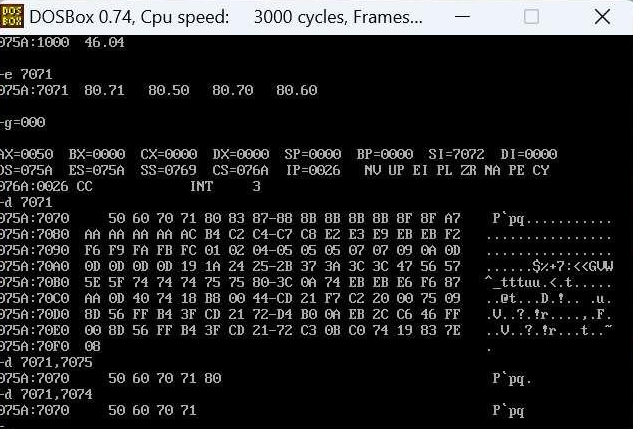
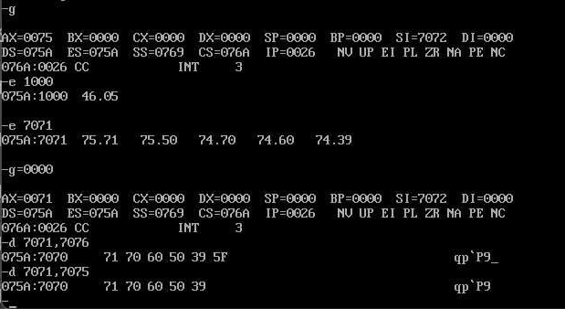

# Microprocessors Lab - Experiment 5

### **Arranging Data Bytes in Ascending and Descending Order using 8086 Microprocessor**

---

### **Aim**  
To write an Assembly Language Program (ALP) to arrange 5 data bytes in ascending and descending order using the 8086 microprocessor and MASM.

---

### **Requirements**  
- **Microprocessor:** 8086  
- **Software:** MASM (Microsoft Macro Assembler)

---

### **Program Code**

#### **(a) Ascending Order:**
```assembly
CODE SEGMENT
ASSUME CS:CODE
START:
    MOV AX, DATA            ; Initialize AX with data segment
    MOV BL, AL              ; Move first byte into BL
    MOV CL, BL              ; Copy BL to CL
    MOV SI, 1000H           ; Set SI to data starting address
    MOV BL, [SI]            ; Load first data byte
    DEC BL                  ; Decrement BL (number of comparisons)

L3:
    MOV CL, BL              ; Copy BL to CL for inner loop
    MOV SI, 7071H           ; Reset SI to start of data

L2:
    MOV AL, [SI]            ; Load current byte
    CMP AL, [SI+1]          ; Compare with next byte
    JLE L1                  ; If current <= next, skip swap
    XCHG AL, [SI+1]         ; Swap the bytes
    MOV [SI], AL            ; Update data

L1:
    INC SI                  ; Move to the next byte
    LOOP L2                 ; Repeat inner loop
    DEC BL                  ; Decrement outer loop counter
    JNZ L3                  ; Repeat outer loop if not zero

    INT 3                   ; End of program
CODE ENDS
```

---

#### **(b) Descending Order:**
```assembly
CODE SEGMENT
ASSUME CS:CODE
START:
    MOV AX, DATA            ; Initialize AX with data segment
    MOV BL, AL              ; Move first byte into BL
    MOV CL, BL              ; Copy BL to CL
    MOV SI, 1000H           ; Set SI to data starting address
    MOV BL, [SI]            ; Load first data byte
    DEC BL                  ; Decrement BL (number of comparisons)

L3:
    MOV CL, BL              ; Copy BL to CL for inner loop
    MOV SI, 7071H           ; Reset SI to start of data

L2:
    MOV AL, [SI]            ; Load current byte
    CMP AL, [SI+1]          ; Compare with next byte
    JGE L1                  ; If current >= next, skip swap
    XCHG AL, [SI+1]         ; Swap the bytes
    MOV [SI], AL            ; Update data

L1:
    INC SI                  ; Move to the next byte
    LOOP L2                 ; Repeat inner loop
    DEC BL                  ; Decrement outer loop counter
    JNZ L3                  ; Repeat outer loop if not zero

    INT 3                   ; End of program
CODE ENDS
```

---

### **Outputs**

#### **(a) Ascending Order Result:**  


#### **(b) Descending Order Result:**  


---

### **Result/Conclusion:**  
We have successfully arranged the entered data bytes in both ascending and descending order using the 8086 microprocessor.

---

**Prepared by:**  
**Name:** Jjateen Gundesha  
**Registration Number:** BT22ECI002  

---  
