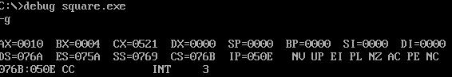
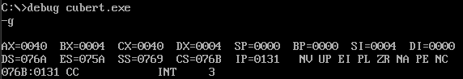

# Microprocessors Lab - Experiment 6

### **Calculation of Square and Cube Root of a Number using 8086 Microprocessor**

---

### **Aim**  
- **(a)** Perform calculation of the square of a number.  
- **(b)** Perform calculation of the cube root of a number.  

---

### **Requirements**  
- **Microprocessor:** 8086  
- **Software:** MASM (Microsoft Macro Assembler)

---

### **Program Code**

#### **(a) Square Calculation:**
```assembly
ASSUME CS:CODE, DS:DATA

DATA SEGMENT
    NO DW 0004H      ; Number (4 in hexadecimal)
DATA ENDS

CODE SEGMENT
START:
    ORG 500H
    MOV AX, DATA     ; Initialize DS with the address of DATA segment
    MOV DS, AX
    MOV AX, NO       ; Load the number into AX
    MUL AX           ; AX = AX * AX (Square calculation)
    MOV BX, NO       ; Store result in BX (optional)
    INT 3            ; End of program
    INT 21H          ; Terminate program
CODE ENDS
END START
```

---

#### **(b) Cube Root Calculation:**
```assembly
ASSUME CS:CODE, DS:DATA

DATA SEGMENT
    NO DW 0040H      ; Number (64 in hexadecimal)
    CUBE_ROOT DW ?   ; Store the cube root result
DATA ENDS

CODE SEGMENT
START:
    ORG 100H
    MOV AX, DATA     ; Initialize DS with the address of DATA segment
    MOV DS, AX

    MOV CX, 0        ; Initialize counter to 0
    MOV BX, 1        ; Initial guess for cube root

find_cube_root:
    MOV DX, 0        ; Clear DX
    MOV SI, BX       ; Store the guess in SI
    MOV AX, SI       ; Load guess into AX
    MUL SI           ; AX = AX * BX
    MUL SI           ; AX = AX * BX (Cube calculation)
    CMP AX, NO       ; Compare result with input number
    JE found_root    ; If equal, found cube root
    JA found_root    ; If AX > NO, stop searching
    ADD BX, 1        ; Increment guess
    INC CX           ; Increment counter
    CMP CX, 1000     ; Limit to prevent infinite loop
    JNE find_cube_root
    JMP end_program  ; End if no root found

found_root:
    MOV DX, BX       ; Store the cube root in DX
    MOV CX, NO       ; Optional: store original number (for reference)
    
end_program:
    INT 3            ; End of program
    INT 21H          ; Terminate program
CODE ENDS
END START
```

---

### **Outputs**

#### **(a) Square Calculation Result:**  


#### **(b) Cube Root Calculation Result:**  


---

### **Result/Conclusion:**  
Thus, we successfully squared a number and found its cube root using the 8086 microprocessor and MASM.

---

**Prepared by:**  
**Name:** Jjateen Gundesha  
**Registration Number:** BT22ECI002  

---
