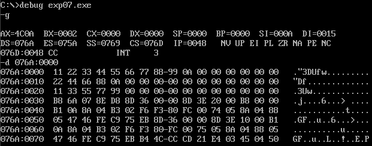

# Microprocessors Lab - Experiment 7

### **Segregating an Array of Numbers into Odd and Even Parts using 8086 Microprocessor**

---

### **Aim**  
To segregate an array of numbers into odd and even parts using the 8086 microprocessor and MASM.

---

### **Requirements**  
- **Microprocessor:** 8086  
- **Software:** MASM (Microsoft Macro Assembler)

---

### **Program Code**

```assembly
DATA SEGMENT
    org 0000h
    array db 11h, 22h, 33h, 44h, 55h, 66h, 77h, 88h, 99h, 0Ah   ; Array of numbers
    org 0010h
    evn db ?            ; Even numbers storage
    org 0020h
    odd db ?            ; Odd numbers storage
data ends

CODE SEGMENT
    assume cs:code, ds:data
start: 
    mov ax, data        ; Load the address of DATA segment into AX
    mov ds, ax          ; Initialize DS register

    lea si, array       ; Load the address of 'array' into SI
    lea di, odd         ; Load the address of 'odd' into DI
    mov ax, 00h         ; Initialize AX to 0
    mov cl, 0ah         ; Loop counter (number of elements in the array)

up:
    mov al, [si]        ; Load the current byte from array into AL
    mov bl, 02          ; Divide by 2 to check even/odd
    div bl              ; AX / BL (Divide AL by 2)
    cmp ah, 00h         ; If AH = 0, the number is even
    je l1               ; Jump to l1 if even
    mov al, [si]        ; Store the odd number
    mov [di], al        ; Store in 'odd' array
    inc di              ; Increment DI (next position)

l1:
    inc si              ; Move to the next element in the array
    dec cl              ; Decrement the counter
    jnz up              ; Repeat until all elements are processed

    lea si, array       ; Reload the address of 'array'
    lea di, evn         ; Load the address of 'even' storage

    mov cl, 0ah         ; Reset loop counter for even numbers
up1:
    mov al, [si]        ; Load the current byte from array into AL
    mov bl, 02          ; Divide by 2 to check even/odd
    div bl              ; AX / BL (Divide AL by 2)
    cmp ah, 00h         ; If AH = 0, the number is even
    jne l2              ; Jump to l2 if not even
    mov al, [si]        ; Store the even number
    mov [di], al        ; Store in 'even' array
    inc di              ; Increment DI (next position)

l2:
    inc si              ; Move to the next element in the array
    dec cl              ; Decrement the counter
    jnz up1             ; Repeat until all elements are processed

skip:
    mov ah, 4Ch         ; Exit program
    int 3
    int 21h
CODE ENDS
END start
```

---

### **Outputs**

#### **Segregated Odd and Even Numbers:**  


---

### **Result/Conclusion:**  
Thus, we successfully segregated an array of numbers into odd and even parts using the 8086 microprocessor and MASM.

---

**Prepared by:**  
**Name:** Jjateen Gundesha  
**Registration Number:** BT22ECI002  

---
