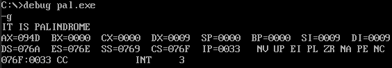
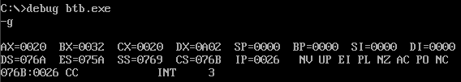

# Microprocessors Lab - Experiment 9

### **Checking Palindrome and Converting BCD to Binary using 8086 Microprocessor**

---

### **Aim**  
- **(a)** Write an ALP to check whether a string is a palindrome or not.  
- **(b)** Write an ALP to convert a BCD number into binary format.

---

### **Requirements**  
- **Microprocessor:** 8086  
- **Software:** MASM (Microsoft Macro Assembler)

---

### **Program Code**

#### **(a) Checking if a String is a Palindrome:**
```assembly
DATA SEGMENT
    BLOCK1 DB 'MALAYALAM'    ; String to check
    MSG1 DB "IT IS PALINDROME $"
    MSG2 DB "IT IS NOT PALINDROME $"
    PAL DB 00H
DATA ENDS

PRINT MACRO MSG
    MOV AH,09H
    LEA DX,MSG
    INT 21H
    INT 3H
ENDM

EXTRA SEGMENT
    BLOCK2 DB 9 DUP(?)        ; Adjust the length of BLOCK2 to match the input string
EXTRA ENDS

CODE SEGMENT
ASSUME CS:CODE, DS:DATA, ES:EXTRA
START:
    MOV AX, DATA
    MOV DS, AX
    MOV AX, EXTRA
    MOV ES, AX
    LEA SI, BLOCK1
    LEA DI, BLOCK2 + 8      ; Adjust destination index to end of BLOCK2
    MOV CX, 0009h           ; Adjust loop count to match string length
BACK:
    CLD
    LODSB
    STD
    STOSB
    LOOP BACK
    LEA SI, BLOCK1
    LEA DI, BLOCK2
    MOV CX, 0009h           ; Adjust loop count here as well
    CLD
    REPZ CMPSB
    JNZ SKIP
    PRINT MSG1              ; Print message if palindrome
    JMP END_PRINT
SKIP:
    PRINT MSG2              ; Print message if not a palindrome
END_PRINT:
CODE ENDS
END START
```

---

#### **(b) Converting BCD to Binary:**
```assembly
DATA SEGMENT
    NO DB 32H               ; BCD number (32 in hexadecimal)
DATA ENDS

CODE SEGMENT
ASSUME CS:CODE, DS:DATA
START:
    MOV AX, DATA
    MOV DS, AX
    MOV AX, 0000H
    MOV BL, NO
    MOV AL, NO
    MOV DL, AL
    AND DL, 0FH             ; Extract the lower nibble
    AND AL, 0F0H            ; Extract the higher nibble
    MOV CL, 4
    ROR AL, CL              ; Rotate AL by 4 to shift higher nibble to lower
    MOV DH, 0AH
    MUL DH                   ; Multiply by 10 (decimal)
    ADD AL, DL              ; Add the lower nibble to AL
    MOV CX, AX              ; Store the result in CX
    MOV BL, NO
    INT 3H
    INT 21H
CODE ENDS
END START
```

---

### **Outputs**

#### **(a) Palindrome Check Result:**  


#### **(b) BCD to Binary Conversion Result:**  


---

### **Result/Conclusion:**  
Thus, we successfully wrote an ALP to check if a string is a palindrome and to convert a BCD number into binary format using the 8086 microprocessor and MASM.

---

**Prepared by:**  
**Name:** Jjateen Gundesha  
**Registration Number:** BT22ECI002  

---
