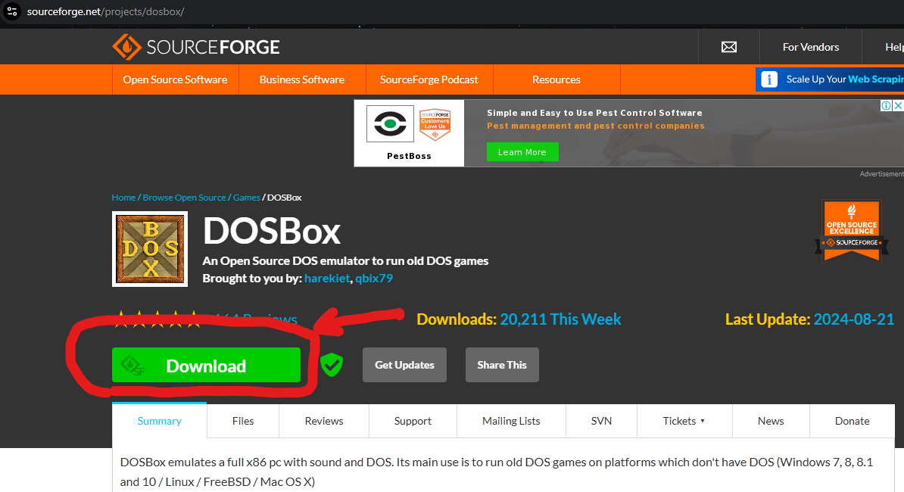

# Microprocessor and Microcontroller Lab (ECE-309) - 8086 Assembly Language Programs

## **Aim of Experiments**

1. **[Experiment 1: Addition of Two Numbers](./01)**  
   Perform the addition of two numbers using the 8086 microprocessor.

2. **[Experiment 2: Arithmetic Operations on 8-bit Numbers](./02)**  
   Perform arithmetic operations (addition, subtraction, multiplication, and division) on two 8-bit numbers using the 8086 microprocessor.

3. **[Experiment 3: Arithmetic Operations on 16-bit Numbers](./03)**  
   Perform arithmetic operations (addition, subtraction, multiplication, and division) on two 16-bit numbers using the 8086 microprocessor.

4. **[Experiment 4: Smallest and Largest Number](./04)**  
   Find the smallest and largest number from a set of entered data bytes/words.

5. **[Experiment 5: Sorting Data in Ascending and Descending Order](./05)**  
   Arrange five data bytes/words in ascending and descending order.

6. **[Experiment 6: Square and Cube Root Calculation](./06)**  
   Perform the calculation of the square of a number and the cube root of a number.

7. **[Experiment 7: Segregating Odd and Even Numbers](./07)**  
   Segregate an array of numbers into odd and even parts.

8. **[Experiment 8: Average and Factorial Calculation](./08)**  
   Calculate the average of five 8-bit numbers and compute the factorial of a number.

9. **[Experiment 9: Palindrome Check and BCD to Binary Conversion](./09)**  
   Check whether a string is a palindrome and convert a BCD number into binary format.

---

## **How to Install MASM on Windows**

Follow these steps to set up MASM (Microsoft Macro Assembler) on your Windows PC using DOSBox.

---

### **1. Set Up DOSBox on Your OS**

First, you need to download and install DOSBox:

1. Visit this link: [Download DOSBox](https://www.dosbox.com/download.php?main=1)  
2. Click on **Download**.  
3. Wait 5 seconds for the download to start automatically.  
4. After downloading, install DOSBox on your PC.  
  
If you need help installing DOSBox, refer to this [Guide on Installing DOSBox on Windows](https://www.dosbox.com/wiki/Installation).

---

### **2. Download `8086.rar`**

1. Visit this link: [Download 8086.rar](#) (Replace with the actual link)  
2. Click on **Download**.

---

### **3. Set Up `8086.rar`**

1. Open the downloaded ZIP file from Step 2.  
2. Extract and copy the `8086` folder to the **C:** drive.

---

### **4. Create an Assembly File (.asm)**

1. Open your favorite code editor.  
2. Enter the following code:

   ```assembly
   ; Hello World program by 360 Tech Explorer’s

   DATAS  SEGMENT
        STRING  DB  'Hello World!',13,10,'$'
   DATAS  ENDS

   CODES  SEGMENT
        ASSUME    CS:CODES, DS:DATAS

   START:
        MOV  AX, DATAS
        MOV  DS, AX

        LEA  DX, STRING

        MOV  AH, 9
        INT  21H 

        MOV  AH, 4CH
        INT  21H
   CODES  ENDS
   END   START
   ```

3. Save this file with the **`.asm`** file extension (e.g., `hello.asm`).

---

### **5. Run the Assembly File in DOSBox**

1. Open **DOSBox**.  
2. Enter the following command to mount the `8086` directory as a C drive:

   ```shell
   Z:> mount c c:\8086
   ```

3. Navigate to drive C:  

   ```shell
   Z:> c:
   ```

4. If you want to create a new assembly file:

   ```shell
   C:> edit file_name.asm
   ```

5. If you already have the assembly file, follow these steps:  
   - Copy your assembly file to the `C:\8086` folder.  
   - Run the following commands:

     ```shell
     C:> masm your_file_here.asm
     C:> link your_file_here.obj
     C:> your_file_here.exe
     ```

---

### **That's it!**  
You've successfully set up MASM and executed an assembly program on Windows using DOSBox.

---

**Prepared by:**  
**Name:** Jjateen Gundesha  
**Registration Number:** BT22ECI002

---

### **For Juniors:**  
If you found this work helpful, please don’t forget to **star this repository** to show your appreciation! 😊

---
